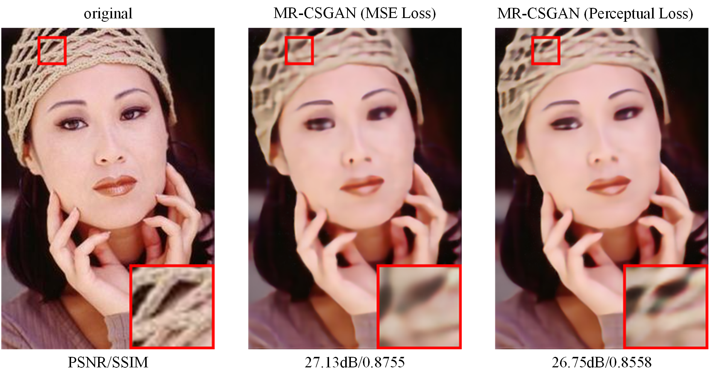

# MR-CSGAN  
This project is the source code of the thesis MR-CSGAN. 
## results show：

You can download the train and test dataset from [baidu disk passward：2uvs](https://pan.baidu.com/s/1ooh9He3cZX2xHwTjr6-1Vg)  
Then put data into dataset.

The version of the python package we use is：  
- python 3.6  
- torch1.7.1+cuda11.0  
- torchvision0.8.2  
- swear 0.4.4  
- scipy1.5.4  
- glob、pandas and so on  

you can use the model we provide for testing.   

[The paper link](https://link.springer.com/article/10.1007%2Fs00371-021-02288-y) 

if you want to cite this papaer, please use:

Tian, J., Yuan, W. & Tu, Y. Image compressed sensing using multi-scale residual generative adversarial network. Vis Comput (2021).

If you have any questions, you are welcome to contact me. My email is: 18800206356@163.com  
 
